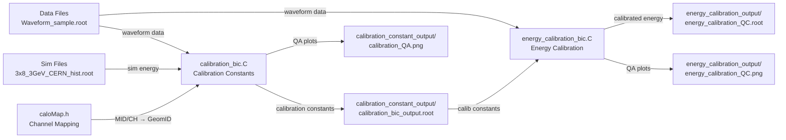

# PS (Preshower) Calibration Analysis

## 📁 폴더 구조

```
202507_PS_prompt_analysis/
├── Data/                          # 데이터 파일들
│   ├── Waveform_sample.root       # 샘플 데이터
│   └── Run_60184_Waveform.root    # 실제 데이터
├── Sim/                           # 시뮬레이션 파일들
│   ├── 3x8_3GeV_CERN_hist.root   # 3GeV 시뮬레이션
│   └── 3x5_5GeV_result_new.root  # 5GeV 시뮬레이션
├── calibration_constant_output/    # 캘리브레이션 상수 결과
├── energy_calibration_output/      # 에너지 캘리브레이션 결과
├── calibration_bic.C              # 캘리브레이션 상수 계산
├── energy_calibration_bic.C       # 에너지 캘리브레이션 적용
├── caloMap.h                      # 채널 매핑 정보
└── README.md                      # 이 파일
```

## 🚀 빠른 시작

### 1단계: 캘리브레이션 상수 계산

```bash
root -l -q -e '.L calibration_bic.C; calibration_bic()'
```

### 2단계: 에너지 캘리브레이션 적용

```bash
root -l -q -e '.L energy_calibration_bic.C; energy_calibration_bic()'
```

## 📋 상세 사용법

### calibration_bic.C

#### 매개변수 설명
```cpp
calibration_bic(
  "Data/Waveform_sample.root",     // 데이터 파일
  "Sim/3x8_3GeV_CERN_hist.root",  // 시뮬레이션 파일
  3.0,                             // 빔 에너지 (GeV)
  true,                            // 트리거 타임 사용
  false,                           // 트리거 번호 사용 안함
  0                                // ADC 임계값
)
```

#### 다른 파일로 실행 예시
```bash
root -l -q -e '.L calibration_bic.C; calibration_bic("Data/Run_60184_Waveform.root", "Sim/3x5_5GeV_result_new.root", 5.0, true, false, 100)'
```

#### 출력 파일
- `calibration_constant_output/calibration_bic_output.root`: 캘리브레이션 상수와 히스토그램
- `calibration_constant_output/calibration_constants.txt`: 캘리브레이션 상수 (CSV 형식)
- `calibration_constant_output/calibration_QA.png`: QA 플롯

### energy_calibration_bic.C

#### 매개변수 설명
```cpp
energy_calibration_bic(
  "Data/Waveform_sample.root",                                    // 데이터 파일
  "calibration_constant_output/calibration_bic_output.root",     // 캘리브레이션 상수 파일
  "energy_calibration_output/energy_calibration_QC.root",        // 출력 파일
  0                                                              // ADC 임계값
)
```

#### 출력 파일
- `energy_calibration_output/energy_calibration_QC.root`: 캘리브레이션된 에너지 히스토그램
- `energy_calibration_output/energy_calibration_QC.png`: QA 플롯