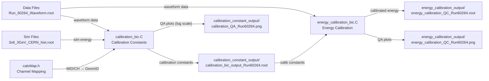

# PS (Preshower) Calibration Analysis

## 📁 폴더 구조

```
202507_PS_prompt_analysis/
├── Data/                          # 데이터 파일들
│   ├── Waveform_sample.root       # 샘플 데이터
│   └── Run_60264_Waveform.root    # 실제 데이터 (Run number 자동 추출)
├── Sim/                           # 시뮬레이션 파일들
│   ├── 3x8_3GeV_CERN_hist.root   # 3GeV 시뮬레이션
│   └── 3x5_5GeV_result_new.root  # 5GeV 시뮬레이션
├── calibration_constant_output/    # 캘리브레이션 상수 결과 (자동 run number 포함)
├── energy_calibration_output/      # 에너지 캘리브레이션 결과 (자동 run number 포함)
├── calibration_bic.C              # 캘리브레이션 상수 계산
├── energy_calibration_bic.C       # 에너지 캘리브레이션 적용
├── caloMap.h                      # 채널 매핑 정보
└── README.md                      # 이 파일
```

## 🚀 빠른 시작

### 1단계: 캘리브레이션 상수 계산

```bash
root -l -q -e '.L calibration_bic.C' -e 'calibration_bic("Data/Run_60264_Waveform.root", "Sim/3x8_3GeV_CERN_hist.root", 3.0, true, false, 0)'
```

### 2단계: 에너지 캘리브레이션 적용

```bash
root -l -q -e '.L energy_calibration_bic.C' -e 'energy_calibration_bic("Data/Run_60264_Waveform.root", "calibration_constant_output/calibration_bic_output_Run60264.root", "energy_calibration_output/energy_calibration_QC_Run60264.root", 0)'
```

## 📋 상세 사용법

### calibration_bic.C

#### 매개변수 설명
```cpp
calibration_bic(
  "Data/Run_60264_Waveform.root",  // 데이터 파일 (Run number 자동 추출)
  "Sim/3x8_3GeV_CERN_hist.root",   // 시뮬레이션 파일
  3.0,                              // 빔 에너지 (GeV)
  true,                             // 트리거 타임 사용
  false,                            // 트리거 번호 사용 안함
  0                                 // ADC 임계값
)
```

#### 다른 파일로 실행 예시
```bash
# 5GeV 데이터로 실행
root -l -q -e '.L calibration_bic.C' -e 'calibration_bic("Data/Run_60184_Waveform.root", "Sim/3x5_5GeV_result_new.root", 5.0, true, false, 100)'

# 샘플 데이터로 실행
root -l -q -e '.L calibration_bic.C' -e 'calibration_bic("Data/Waveform_sample.root", "Sim/3x8_3GeV_CERN_hist.root", 3.0, true, false, 0)'
```

#### 출력 파일 (자동 run number 포함)
- `calibration_constant_output/calibration_bic_output_Run60264.root`: 캘리브레이션 상수와 히스토그램
- `calibration_constant_output/calibration_constants_Run60264.txt`: 캘리브레이션 상수 (CSV 형식)
- `calibration_constant_output/calibration_QA_Run60264.png`: QA 플롯 (log scale, 정규화 적용)

#### QA 플롯 특징
- **Log scale**: 작은 분포도 잘 보이도록 로그 스케일 적용
- **정규화**: 모든 히스토그램을 이벤트 수로 정규화하여 분포 모양 비교 가능
- **y축 통일**: 모든 패드의 y축 최대값을 동일하게 맞춤

### energy_calibration_bic.C

#### 매개변수 설명
```cpp
energy_calibration_bic(
  "Data/Run_60264_Waveform.root",                                    // 데이터 파일
  "calibration_constant_output/calibration_bic_output_Run60264.root", // 캘리브레이션 상수 파일
  "energy_calibration_output/energy_calibration_QC_Run60264.root",    // 출력 파일
  0                                                                   // ADC 임계값
)
```

#### 출력 파일 (자동 run number 포함)
- `energy_calibration_output/energy_calibration_QC_Run60264.root`: 캘리브레이션된 에너지 히스토그램
- `energy_calibration_output/energy_calibration_QC_Run60264.png`: QA 플롯

## 🔧 주요 기능

### 자동 파일명 생성
- 입력 데이터 파일명에서 **Run number 자동 추출**
  - `Run_60264_Waveform.root` → `Run60264`
  - `Waveform_sample.root` → `Waveform_sample`
- 모든 output 파일명에 자동으로 run number 추가
- 여러 run을 실행해도 결과 파일이 섞이지 않음

### QA 플롯 개선
- **Log scale**: double peak, long tail 등 복잡한 분포도 잘 보임
- **정규화**: 분포 모양 비교에 최적화
- **y축 통일**: 모든 모듈의 분포를 한눈에 비교 가능

### 에러 처리
- 파일 없음, TTree 없음 등에 대한 명확한 에러 메시지
- 캘리브레이션 상수 매핑 실패 시 경고 메시지

## 📊 결과 해석

### calibration_bic.C 결과
- 각 GeomID별 L/R 채널의 캘리브레이션 상수
- 시뮬레이션 대비 데이터 분포 비교
- QA 플롯에서 분포 모양과 상대적 크기 확인

### energy_calibration_bic.C 결과
- 캘리브레이션된 에너지 분포 (GeV → MeV 변환)
- 각 GeomID별 에너지 해상도
- 전체 시스템의 에너지 해상도

## 🚨 주의사항

1. **파일 경로 확인**: Data/, Sim/ 폴더에 필요한 파일이 있는지 확인
2. **ROOT 환경**: ROOT가 설치되어 있고 환경이 설정되어 있어야 함
3. **linter 에러**: 코드 에디터에서 linter 에러가 나도 ROOT에서는 정상 실행될 수 있음
4. **실행 순서**: 반드시 1단계(calibration) → 2단계(energy calibration) 순서로 실행